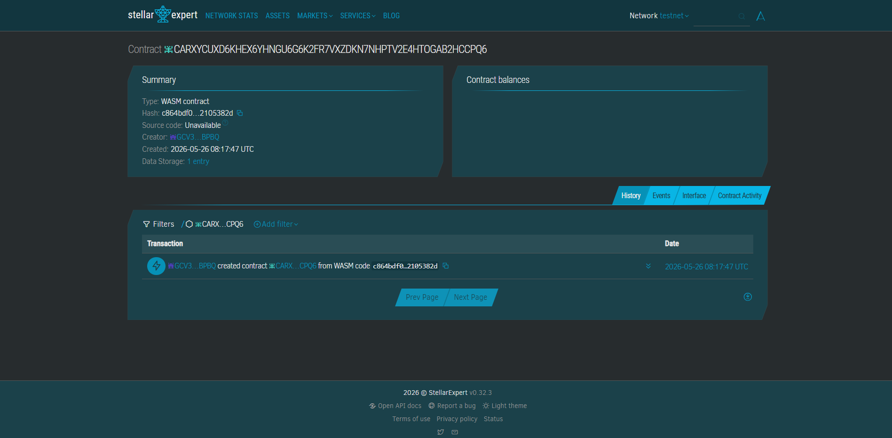

IslandPay Escrow
Secure trustless trade for Philippine micro-exporters.

Problem & Solution
Maria in Cebu loses revenue to slow bank wires and trust gaps with buyers. IslandPay uses Soroban to lock USDC in escrow, releasing funds instantly upon digital shipment verification.

Timeline
Day 1: Soroban Contract & Testing

Day 2: Frontend Integration (Freighter Wallet)

Day 3: Demo & Pitch

Stellar Features
Soroban Smart Contracts

USDC Asset Transfers

Stellar Auth (ED25519)

Prerequisites
Rust & Cargo

Soroban CLI v20.0.0+

Usage
Build:
soroban contract build

Test:
cargo test

Deploy:
soroban contract deploy --network testnet --source-account <ALIAS> --wasm target/wasm32-unknown-unknown/release/island_pay_escrow.wasm

Call MVP Function:
soroban contract invoke --id <CONTRACT_ID> --source-account <BUYER> --network testnet -- create_escrow --buyer <BUYER_ADDR> --seller <SELLER_ADDR> --token_addr <USDC_ADDR> --amount 500000000

License
MIT

#DeployedContract
CARXYCUXD6KHEX6YHNGU6G6K2FR7VXZDKN7NHPTV2E4HTOGAB2HCCPQ6

#Proof
